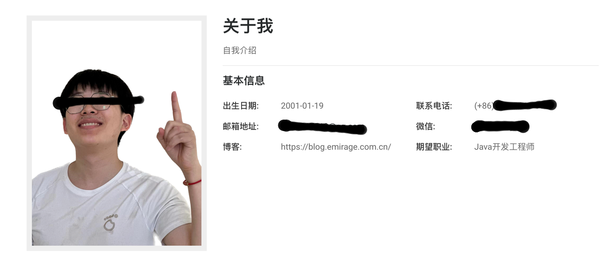
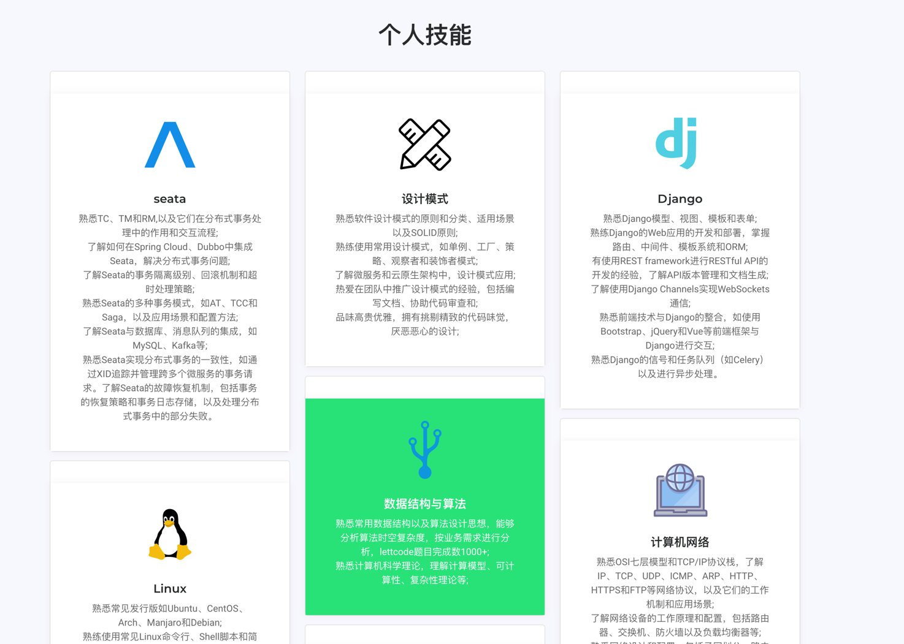
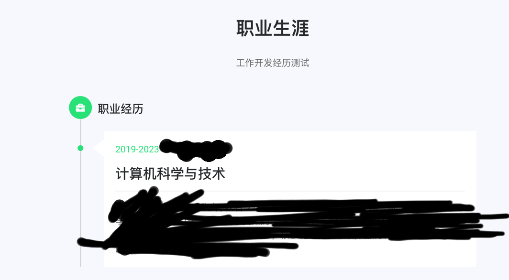

## 项目截图






## 使用说明

### 修改数据库连接信息，以及希望的端口号
```
server:  
  port: 8080
spring:  
  datasource:  
    url: jdbc:mysql://IP:port/数据库名称?useSSL=false&serverTimezone=UTC  
    username: 登录账号
    password: 密码
    driver-class-name: com.mysql.cj.jdbc.Driver
```

### 构建数据库
运行SQL
脚本位置：my_cv/cv.sql

### 配置个人信息
主要按照数据库结构配置即可。

编写Dockerfile
```
FROM openjdk:17-jdk
WORKDIR /app
# 将构建好的应用jar文件复制到容器内 
COPY ./Martyn-web-0.0.1-SNAPSHOT.jar /app 
EXPOSE 43897
# 容器启动时执行的命令
CMD ["java", "-jar", "Martyn-web-0.0.1-SNAPSHOT.jar"]
```
构建
```bash
docker build -t cv_v1  .
```

启动命令
```bash
docker run -p 43897:43897 -v/root/data:/app/data cv_v1
```
如果需要本地访问，则直接把想访问的文件放到/root/data

打开80 443防火墙

配置NGINX
在NGINX配置下添加 cv_ssl.conf
```
server { 
    listen       80; 
    # 配置域名     
    server_name  cv.emirage.com.cn; 
    return       301 https://cv.emirage.com.cn$request_uri; 
    # 配置让这些 HTTP 的访问全部 301 重定向到 HTTPS 的
    #rewrite ^(.*) https://blog.emirage.com.cn$1 permanent;  
}                                                                                                                                                                                   

server {                                                                                                                                                                            
    # 监听 443 https 端口  
    listen 443 ssl http2; 
    server_name cv.emirage.com.cn;  
    ssl on; 
    client_max_body_size 4M;  
    root html; 
    index index.html index.htm;
    # ssl 证书存放路径 
    ssl_certificate 证书路径/fullchain.pem;                                  
    ssl_certificate_key  证书路径/privkey.pem;   
    ssl_session_timeout 5m;  
    ssl_ciphers ECDHE-RSA-AES128-GCM-SHA256:ECDHE:ECDH:AES:HIGH:!NULL:!aNULL:!MD5:!ADH:!RC4;  
    ssl_protocols TLSv1 TLSv1.1 TLSv1.2;
    ssl_prefer_server_ciphers on; 
   location / {                                                                                                                                                                     
        root   /usr/share/nginx/html;   
        index  index.html index.htm; 
        proxy_set_header Host $host;
        proxy_set_header X-Real-IP $remote_addr;
        proxy_set_header X-Forwarded-For $proxy_add_x_forwarded_for; 
        proxy_pass http://172.17.0.1:43897; # 反向代理   因为使用了docker
    }                                                                                                                                                                               
    #error_page  404              /404.html;
    # redirect server error pages to the static page /50x.html  
    #                                                                                                                                                                               
    error_page   500 502 503 504  /50x.html; 
    location = /50x.html { 
        root   /usr/share/nginx/html; 
    }                                                                                                                                                                               
}
```

之后就可以正常访问。
